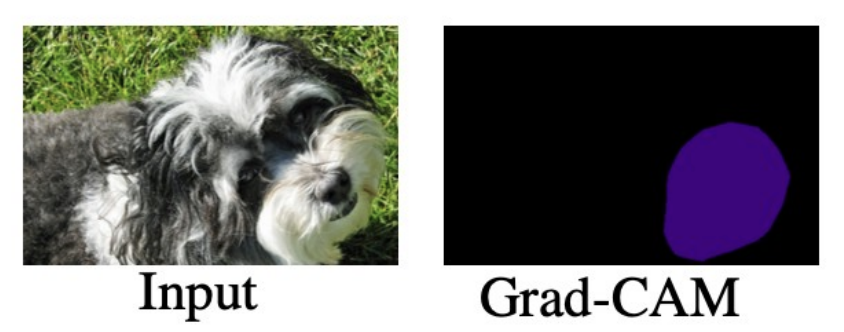

# PseudoSeg: Designing Pseudo Labels for Semantic Segmentation

## Problem they are trying to solve / Purpose of method

- specific to semantic segmentation.
- leverage more data in settings where the amount of pixel labels is low. 

## How does it differ from other methods?

- One-stage training framework

Other methods in semi-supervised learning for semantic segmentation are often complex pipelines.
They often require multi-stage training.
Meaning they first train some component before they can begin final training.
In this method everything can be trained in one stage, which is most likely faster. 

## How the method works

To understand the method, it first requires understanding something called Grad-CAM. 

To produce a grad-cam output, we need a classifier head.
Intuitively, it tells us what regions was the most important for the classification.
They do not really produce good segmentation maps though.
But many methods have used this as a starting point to produce segmentation maps.
This method first finds the Grad-CAM output, and then *refines* them. 

The refinement process is very similar to the self-attention mechanism.
"Key" and "query" are computed from with output from the backbone,
and "value" is the grad-cam output.
intuition: use information from the backbone to compute the similarity between regions,
and then we can "spread", or propagate,
the grad-cam output to other regions if they are deemed similar. 

TRAINING:
- supervised data:
	- classifier (if unsupervised is completely unlabelled)
	- self-attention refinement module
	- decoder
	
- unsupervised data:
	- consistency training 

However, the refined grad-cam output is still not our "pseudo labels".
It is not impossible to just use those as pseudo labels,
but they show better results with an extra step.
The main issue is that the refined grad-cam maps are still in low resolution,
which means they have to be directly upsampled (for example with interpolation),
which produces unsatisfactory results.
So, they combine the "SGC maps" (same as refined grad-cam maps) with the decoder prediction.
The fusion process includes normalizing the scores from the
decoder and the SGC maps (to account for different degrees of activation),
and then sharpening with some temperature T.
After this fusion, we have obtained our pseudo label. 

This pseudo labels are then used as the "true value" in a cross entropy loss function.
the predictions are on "strongly" augmented images.
Note that often in consistency training, we use a soft loss.
This means we compute loss with probability distributions instead of having hard labels. 
