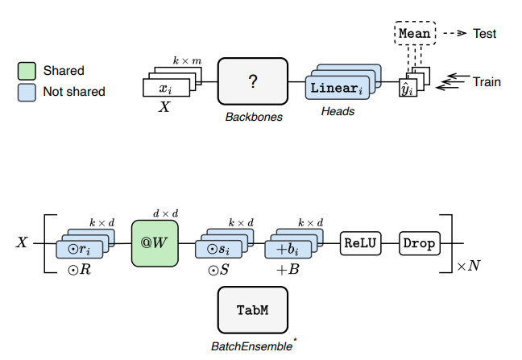

# TABM
Contributer: Elias Ruud Aronsen

This is a summary of **TABM** (Tabular Multiple Predictions), a simple but powerful method for deep learning on tabular data.

TabM makes a single MLP behave like an ensemble of multiple MLPs, particularly a bagging ensemble, by sharing most parameters while producing multiple independent predictions per input. Inspired by BatchEnsemble, but specifically tuned for tabular tasks, TABM achieves better generalization, faster training, and smaller model sizes compared to traditional deep ensembles or transformer-style models.

So the **MAIN CONTRIBUTION** is:

"introducing a parameter-efficient way to simulate an ensemble of MLPs using a single model, achieving strong performance on tabular benchmarks with minimal computational overhead."

#### Key ideas:
- Multiple predictions per sample, trained together, we choose the amount by defining **k**, which is a tunable parameter.

- Heavy weight sharing to keep it efficient and faster. Most model weights are shared across submodels, keeping the architecture more lightweight and efficient compared to completely seperate MLP models.

- Even though individual predictions may be weak, the aggregated output benefits from strong generalization due to implicit ensembling.

### Figure representation:

- Here the top figure shows the the general idea of TabM. 
   A single TabM model processes k parallel inputs and produces k outputs, which are averaged to get the final prediction.

   This is common to all TabM variants(TabM, TabM_mini etc.). This is how they process k inputs in parallel.

- The bottom figure is zoomed into the "Backbones box" section of the top figure. It shows the main TabM model structure, particullary the internal architecture of a single block in TabM, illustrating how it applies parameter-efficient ensembling using BatchEnsemble-style weights. Each input sample is transformed using element-wise multiplications with some new learned, non-shared weights (`rᵢ`, `sᵢ`, `bᵢ`) around a shared linear weight matrix `W`. This structure enables TabM to simulate an ensemble of `k` submodels with minimal overhead, and is repeated `N` times to form the full MLP backbone.

### What the paper shows:
- **Variants of TabM**: The paper introduces and compares multiple TabM variants, from `TabMpacked` (no weight sharing) to `TabMnaive` and `TabMmini`, culminating in the final `TabM` with selective initialization for improved regularization and expressivity. You can see these variants on the Github also.

- **Performance analysis**: TabM consistently outperforms not only plain MLPs but also attention-based and retrieval-based models like FT-Transformer and TabR on a diverse benchmark of 46 tabular datasets. TabR is another earlier model of the authors that is more of a Nearest Neighbors + deep learning model. 

- **Training dynamics**: The paper shows that individual submodels in TabM tend to overfit, but their average generalizes better. This is evidence that TabM benefits from meaningful diversity between submodels, much like traditional ensembles.

- **Efficiency evaluation**: TabM is significantly more efficient than deep ensembles or transformer-based models due to the parameter sharing, in terms of training time, inference throughput, and parameter count, especially on large datasets.

- **Submodel pruning**: After training, it’s possible to select a subset of submodels (e.g. via greedy selection) to reduce inference cost with minimal performance drop.

- **Regularization effect**: Sharing weights across submodels naturally reduces overfitting and increases neuron utilization (fewer “dead” neurons), which contributes to better overall performance.

### Limitations:
- While TabM is more efficient than deep ensembles, it's still slower than a plain MLP.
- Not explicitly designed for uncertainty estimation or multitask learning. Authors mention this as potential future work.
- While TabM outperforms many deep learning models on tabular tasks, GBDTs like XGBoost still tend to generalize better on small datasets due to their low overfitting tendency and strong inductive bias. TabM is more beneficial when working with larger datasets or when needing ensembling efficiency in a deep learning context.

#### Info:
You can see a implementation of TABM and try it yourself with the authors' official repository: [TabM GitHub Repo](https://github.com/yandex-research/tabm).

You can also read the paper on the novel model here: [TabM Paper](https://arxiv.org/abs/2410.24210).