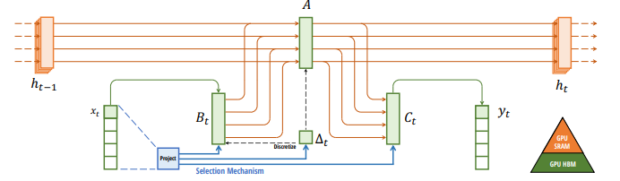
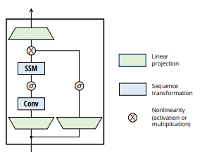

# Mamba: Linear-Time Sequence Modeling with Selective State Spaces

NOTE: As there are many types of SSM architectures the wording can get quite confusing. In this paper two major ssm architectures are important, structured ssms (S4 models) and selective ssm (S4 model with selective updates). In both the paper and this overview we refer to structured ssms (S4 models) as SSM and the selective SSM as selective SSM.

## Resources:

- Link to paper: https://arxiv.org/pdf/2312.00752
- Youtube videos that might be useful when learning about the paper: 
- For an overview: https://www.youtube.com/watch?v=vrF3MtGwD0Y&t=16s (highly adviced)
- For understanding calculations: https://www.youtube.com/watch?v=N6Piou4oYx8&t=1605s

## Problem they are trying to solve / Purpose of method

### What are the previous problems that needs to be solved?

- Currently transformers are the dominant architecture for sequence and foundation models. However, they suffer from quadratic complexity in both computation and memory with respect to sequence length due to the self-attention mechanism. This inefficiency is a major hindrance for transformers, and is what mamba tries to fix through the use of state space models (SSM).

## How does it differ from other methods?

- Linear time complexity: Unlike transformer's quadratic complexity, Mamba uses Selective SSMs with linear recurrence, which allows processing sequences in O(n) time and space.
- Continous time modelling: Instead of utilizing attention to model long range dependencies, Mamba uses selective SSMs to model these dependencies more efficiently..
- Selective SSM: Instead of using attention to gain context, mamba uses selective SSMs, which enables context aware updates for each timestep, similar to how attention applies context.
- Parallell training: Similar to self-attention, parallell training is applied in mamba aswell, but unlike Transformers, it uses SSMs and a technique called **parallel associative scan**, avoiding pairwise multiplication

## How the method works

### Simple Overview:
Mamba processes sequences using a state space model (SSM) that applies a learned filter over time (SSM), maintaining a hidden state without pairwise comparisons. Each input is passed through a gate that controls how much it influences the state update. This allows the model to handle long-range dependencies efficiently. By using parallel scan algorithms, Mamba computes these updates across the full sequence in linear time making it faster and more reliable than transformers for long range input.

### SSM

State Space Models process sequences by updating a hidden memory state over time, using matrices Δ,𝐴,𝐵, and 𝐶 to control how information flows through the system. Two key components are the discretization step (which converts continuous dynamics into a form usable by computers, recurrency or convolution) and the computation step (which applies the update across the sequence). These models use a learned kernel from the computation step to apply updates efficiently in linear time, making them fast and memory efficient. Although we now have to ways to compute the components (recurrency and convolution), the most viable option by far is the convolution method.

Downside:
Basic SSMs apply the same update rules across all inputs, which limits their ability to learn different contexts.

### Selective SSMs
Selective SSMs improve standard SSMs by introducing selective updates that controls how much of the input should influence the memory at each step i.e. independent Δ,𝐴,𝐵, and 𝐶 for each step. This way we get independent context for each timestep, similar to the attention mechanism in transformers.

Downside:
The selective updates introduces sequential dependencies, making it impossible to use the convolution idea. Mamba solves this using a **parallel associative scan**, thus a kind of convolution is implemented, by storing intermediate steps for fast computations. As some of the steps done to achieve this linearity is highly technical, it is not important to know the details about this, but it is important to know that the linearity of mamba comes from the addition of parallell associative scan.

### Mamba architecture

How one mamba block is processed:
- Pass input into two paths 
    - One Path that computes non linearity for current timestep
    - One path that uses previous timestep to take into account context (ssm path, on the left side of mamba architecture)
- Input projection (upscale dimensionality for both paths) 
    - In order to get more information from the input we upscale the dimensionality. This makes mamba able to capture more nuances and details.
- Convolution layer (for ssm path)
    - Now after upscaling we want to capture the most important features of that upscaled dimensionality, thus we apply a convolution layer to capture this information.     
- SiLU activation function is applied for non linearity is applied for both paths
- Selective SSMs (ssm path)
    - Now we take into account the previous timesteps to check for dependencies (or context).
- Combination with non linearity activation.
    - Now a similiarity measure is computed between the two paths to achieve output.
- Output projection (downscale dimensionality)
    - Lastly we project back to the correct output size.

Now that we have one mamba block, we can similar to other architectures, stack these block on top of each other to make deeper architecture. 
