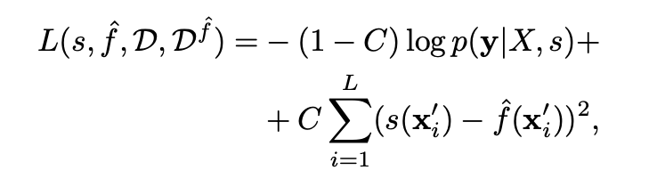
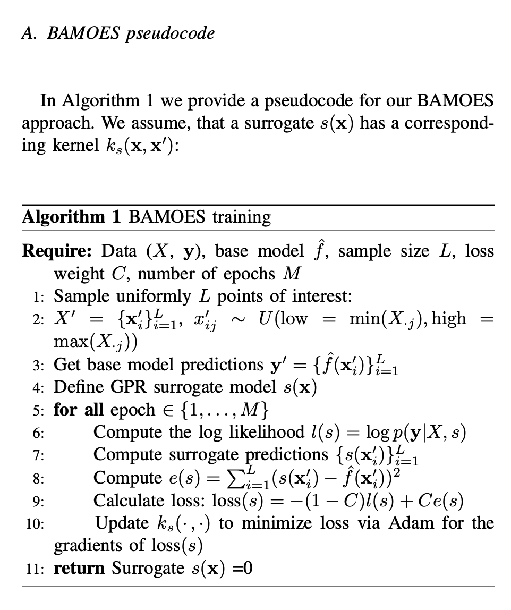

# Surrogate uncertainty estimation for your time series forecasting black-box: learn when to trust

## Problem they are trying to solve / Purpose of method

- The purpose of the model is to equip an already trained forecasting model with an uncertainty estimate
- Be able to equip uncertainty estimation on any forecasting model as long as you have a trained model and the data trained on the model

## How does it differ from other methods?

- Instead of a built in method in the forecasting model, the method is an extension. 
- The surrogate model is trained on same training data as the base model (black box model), but also enhanced by the base model

## How the method works

### Overview

#### BAMOES (Base-model-enhanced surrogate model)

- The surrogate model is a realization of gaussian process regression. 
- The surrogate model trained with a combined loss function. 
- They train a surrogate model to mimic the base model (already trained  model). 
- The uncertainty prediciton will be a normal distrobution (gaussian) where the mean is the predicion from the base model and the standard diviation from the surrogate model

### New dataset

The method samples L amount of random datapoints from the domain the training points are in. This is used to query the base model to make new predictions the surrogate model will train to mimic the base model

### Loss function

- The loss function is two parts
- Loglikelihood between the training data and the surrogate model
- Mse between surrogate model predictions and the base model predictions. This is only on the new sampled data (from new dataset) and not the original training data

### Hyper parameters

- L, how many random datapoints to sample from the domain. Between 0-N amount. Where N is the size of trainin data.
- C, the coeffcient to the loss function. Between 0-1. Higer C, more value more the mse between surrogate prediction and base model prediction. Lower C, value more the likelihood between the surrogate model and the training data.

### Training

To the train the model:

- sample L amount of datapoints
- get the basemodel predictions on the new sampled data
- define the surrogate model (gaussian process regression)

